# CyberFortress: Attack Simulation and Defense

## Project Summary
CyberFortress is a cybersecurity simulation demonstrating an attack and defense scenario on an Azure-hosted Windows Server VM. It leverages PowerShell to simulate a brute-force attack and implement defensive measures, including account hardening and firewall activation. The project runs on Azure Virtual Machines in a Windows Server 2022 environment, showcasing cloud management and security automation skills.

## Demonstration
This section walks through the CyberFortress simulation, showcasing an attack and defense scenario:

1. **Deploy the VM**:  
   - Created "SecSimVM" in Azure under "CyberSimRG" (Windows Server 2022, D2s size).  
   - Managed via the Azure Portal:  
     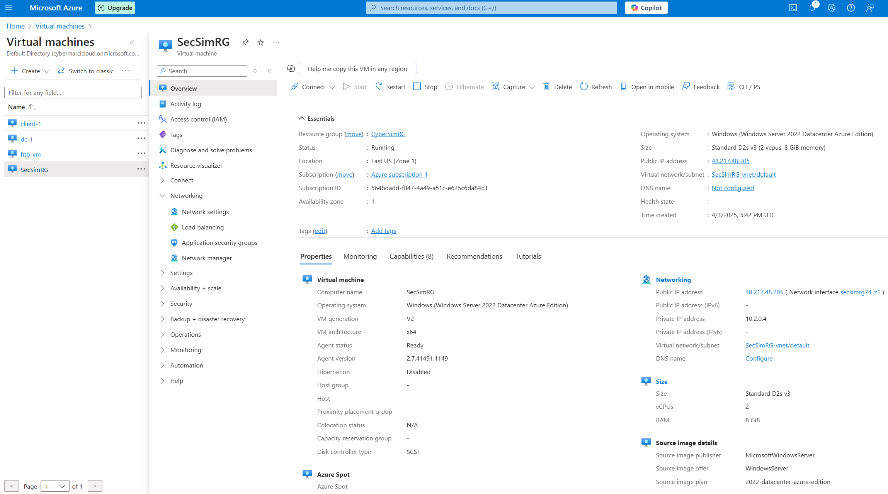

2. **Simulate the Attack**:  
   - Execute `SimulatedAttack.ps1` in PowerShell (Admin mode) to mimic a brute-force attempt.  
   - Visual alert:  
     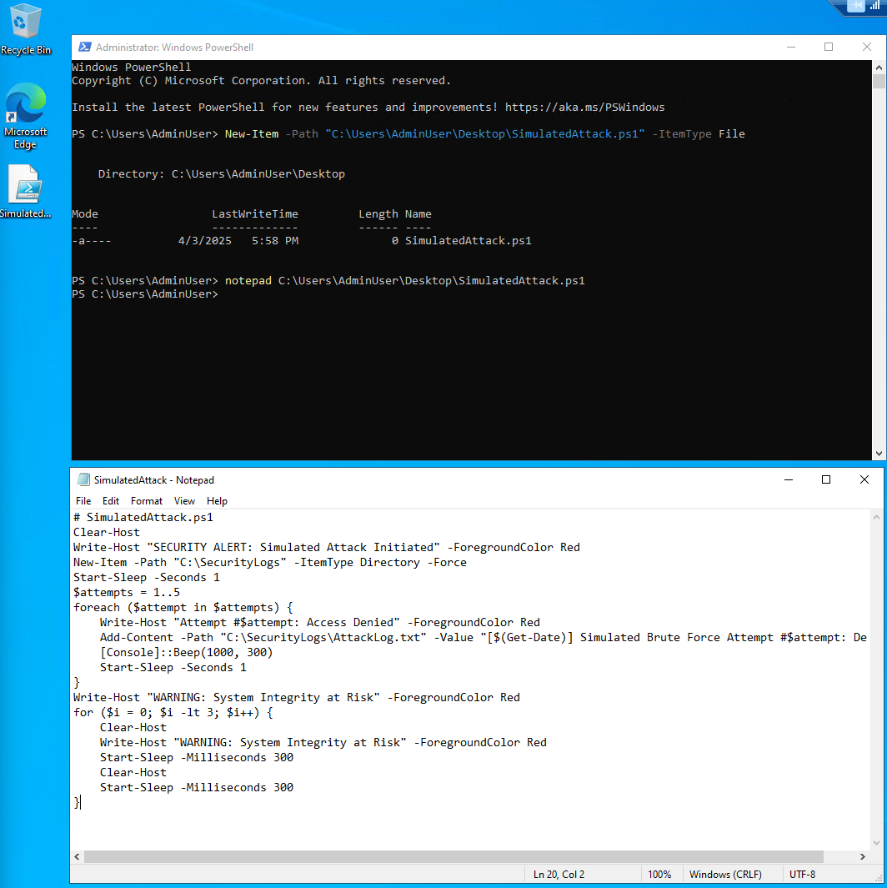  
   - Attack sequence:  
     - Initial alert triggers:  
       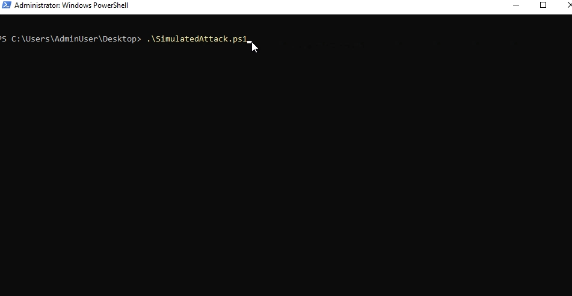  
     - Brute-force attempts escalate:  
       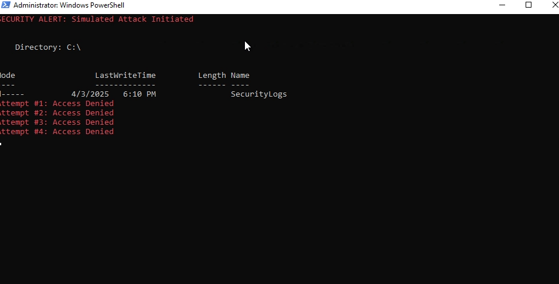  
     - System under threat warning:  
       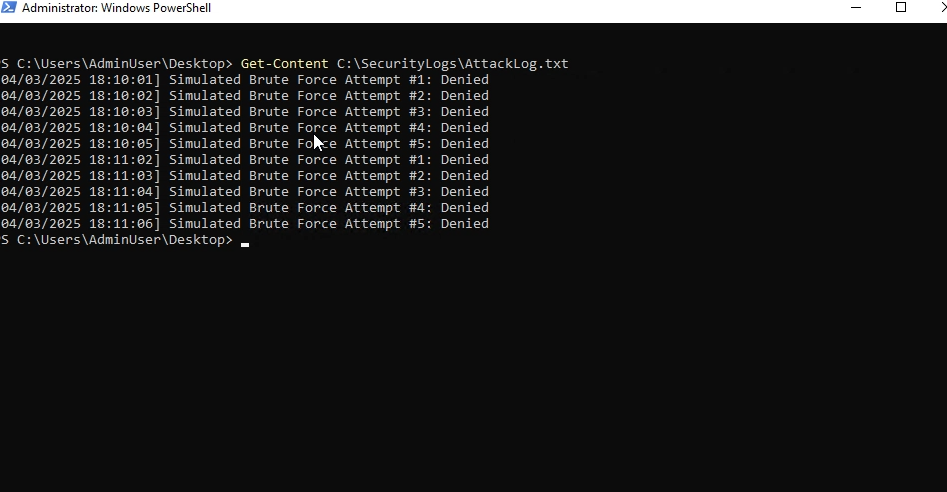  
   - Video of the attack in action:  
     [Watch Attack Demo](images/DemoAttack.mp4)

3. **Defend the System**:  
   - Run `FortressDefense.ps1` to harden the VM by disabling the Guest account and enabling the firewall.  
   - Success confirmation:  
     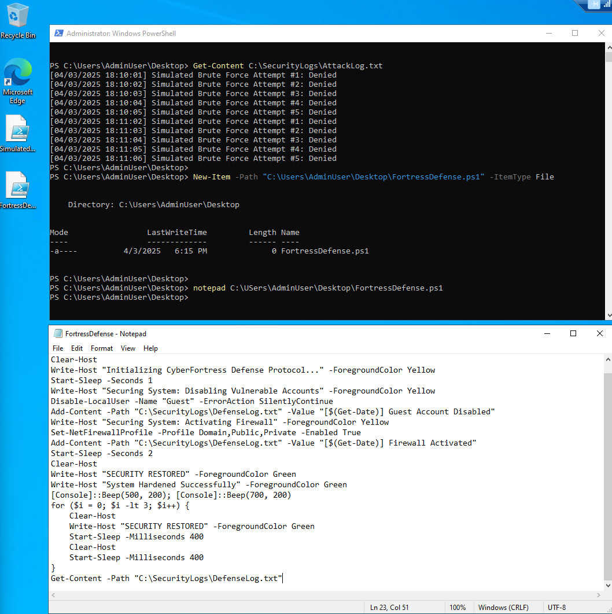  
   - Defense sequence:  
     - Defense protocol initiates:  
       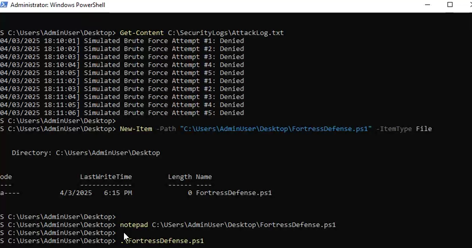  
     - Disabling vulnerable accounts:  
       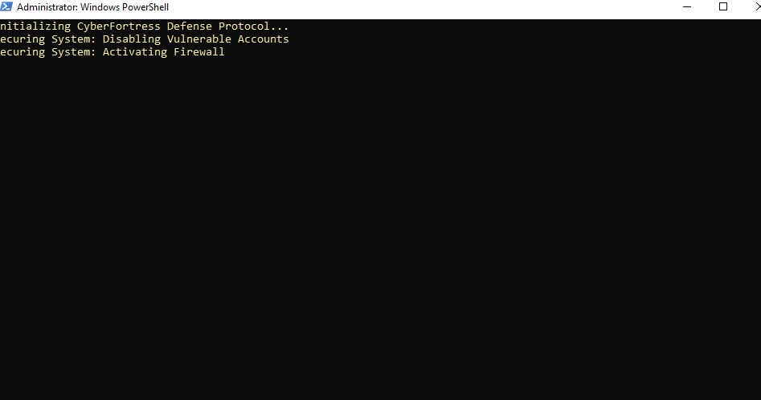  
     - Firewall activation:  
       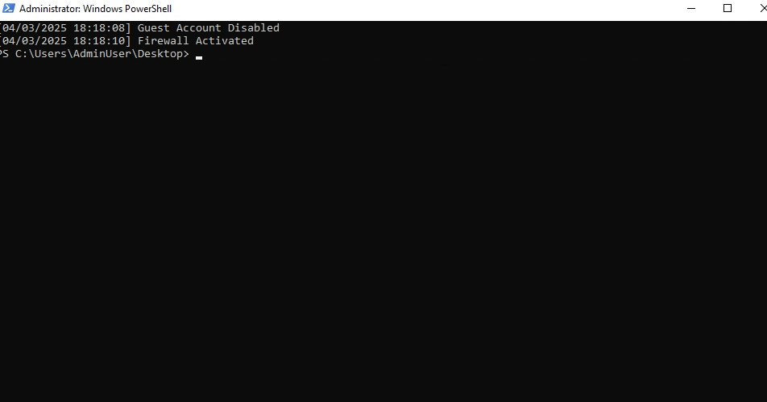  
     - Security restored:  
       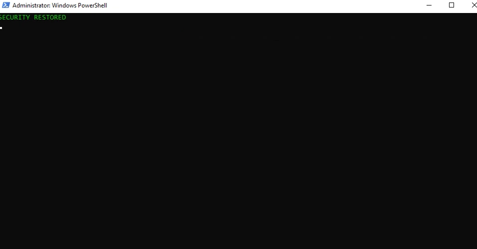  
   - Video of the defense response:  
     [Watch Defense Demo](images/DemoDefense.mp4)

4. **Verify Security Logs**:  
   - Check `C:\SecurityLogs` for attack and defense records:  
     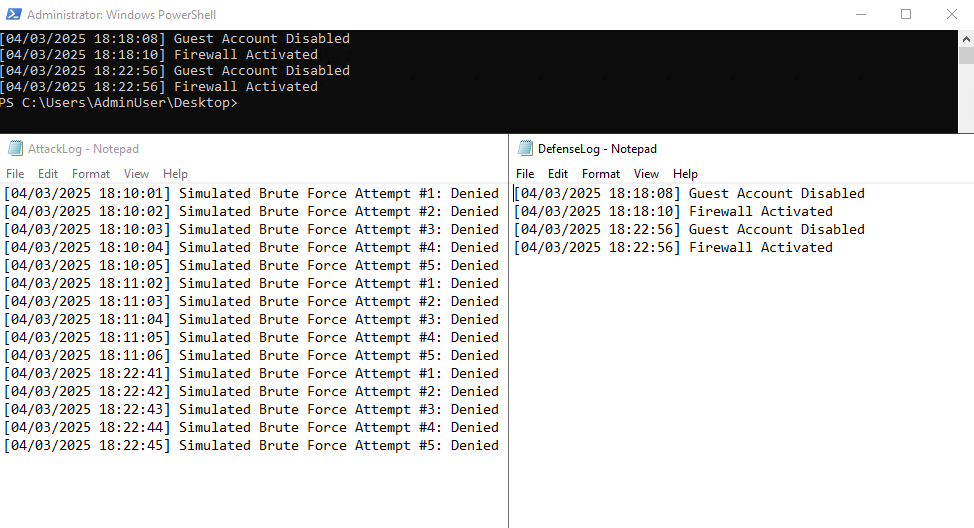

This project demonstrates proactive security automation in a cloud environment, blending Azure management with PowerShell scripting.

*Built this project to demonstrate rapid problem-solving and technical expertise along side my CourseCareers Final Project.*
